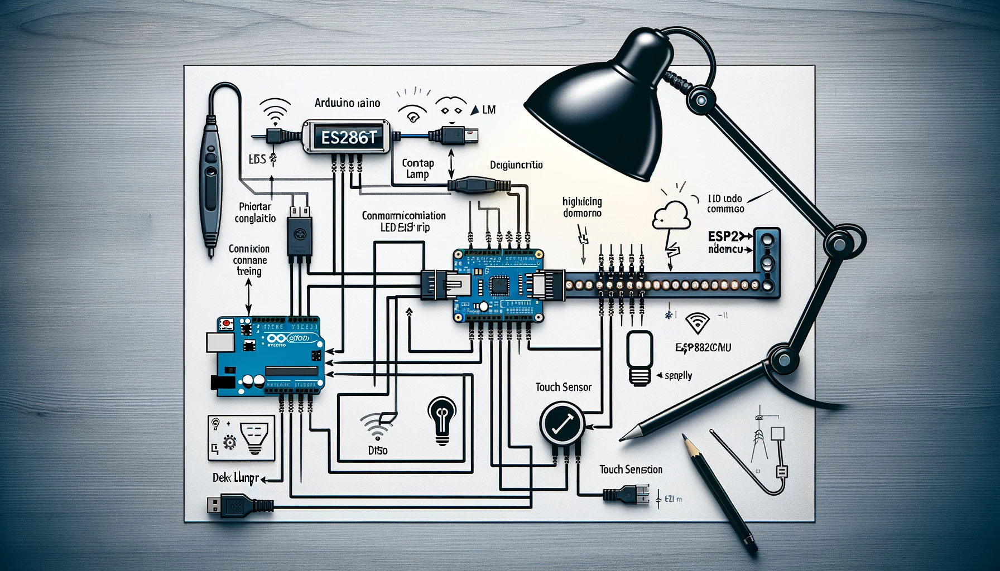
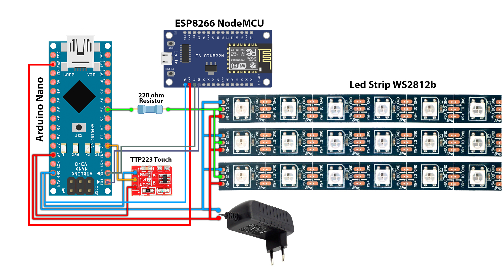

# IoT Desk Lamp Project 🌟🔌

Welcome to the repository for an innovative IoT Desk Lamp designed for modern university and office environments. This lamp is not just a source of light; it's a smart, interactive device controlled via a web server and featuring a variety of dynamic lighting effects. 🎨💡

## Repository Structure 🗂️

- **`/firmware`**: All firmware related to the project.
  - **`/lamp_server`**: NodeMCU code for the web server.
    - `lamp_server.ino`: Web server code for the ESP8266 NodeMCU.
  - **`/desk_lamp`**: Arduino Nano code for the lamp.
    - `desk_lamp.ino`: Main lamp control code.
    - `effects`: Code file for various lighting effects.
- **`/libraries`**: Required libraries for the project.

## Features ✨

- Multiple lighting modes with adjustable brightness.
- Touch sensor for local control.
- Web server interface for remote control.
- Energy-efficient LED usage.
- Customizable settings for different environments.

## Getting Started 🚀

### Prerequisites 🛠️

- Arduino IDE.
- Arduino Nano.
- ESP8266 NodeMCU.
- WS2812b LED strip.
- TTP223 touch sensor
- Relevant libraries (see `/libraries` directory).

### Installation and Setup 🔌

1. **Clone the Repository**: Clone or download this repository to your local machine.
2. **Open Firmware**: Navigate to `/firmware` and open the `.ino` files in the Arduino IDE.
3. **Upload Firmware**:
   - Upload `desk_lamp.ino` to the Arduino Nano.
   - Upload `lamp_server.ino` to the ESP8266 NodeMCU.
4. **Hardware Assembly**: Assemble the hardware components as per the schematics.
5. **Install Libraries**: Ensure all necessary libraries are installed in the Arduino IDE.

### Connection Scheme 📈

## Configuration ⚙️

- **Web Interface**: Access the lamp's web interface via the IP address provided by the ESP8266 NodeMCU. Here, you can control various aspects of the lamp.
- **Touch Sensor**: Use the touch sensor for quick on/off control and mode switching.

## Usage 🎛️

Control the lamp via the web interface or the touch sensor. Experiment with different modes and settings to find the perfect lighting for your space.

## Contributing 🤝

Your contributions are what make the community amazing! We welcome contributions to this project. Please follow the standard fork-and-pull request workflow.

## Troubleshooting 🛠️

Encountering issues? Check the following:

- Ensure all connections are secure and correct.
- Verify that the correct firmware is uploaded to the respective devices.
- Confirm that all required libraries are installed.

## License 📜

This project is released under the [MIT License](LICENSE).
